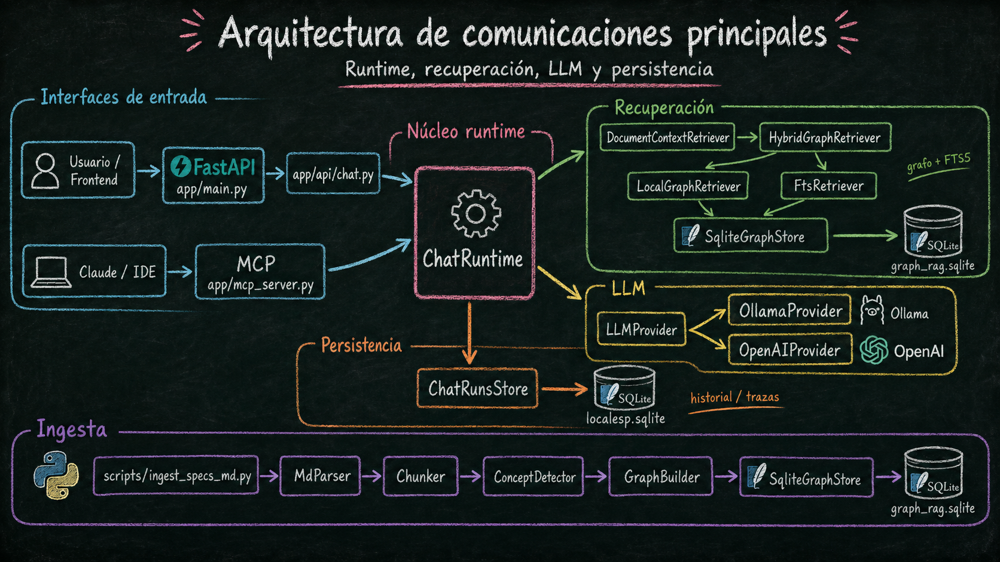

## 👋 Hola, soy Jose González

Ingeniero con experiencia industrial y aeroespacial, actualmente orientado a Backend, AI Operations y LLMOps.

Estoy construyendo proyectos propios alrededor de modelos locales con trazabilidad y evaluación de sistemas.

En paralelo, soy docente de IA aplicada para perfiles no técnicos. Intento enseñar una IA clara, sencilla, alejada del hype y centrada en uso práctico, criterio técnico y límites reales.

## 🚀 Proyectos destacados

### LocalEsp
Sistema local de análisis documental basado en Graph-RAG sobre SQLite.

Objetivo: convertir documentación técnica en una base consultable, trazable y operable sin depender ciegamente de modelos externos.

  

### NúcleoChat / LOCALES
Gateway LLM local con FastAPI, RAG, trazas, métricas y evaluación de ejecuciones.

## 🧭 Enfoque técnico

Me interesa especialmente llevar la IA desde el prototipo hacia sistemas más operables:

- Qué falla
- Cuánto cuesta
- Qué evidencia usa
- Qué latencia tiene
- Qué modelo respondió
- Qué recuperación documental se utilizó
- Cómo se puede auditar una respuesta

## 🤖 Desarrollo asistido por IA

## 🛠️ Backend / AI Operations

## 🧠 IA / LLMOps

## 🏭 Ingeniería industrial / CAD

## 🧮 Base técnica previa

